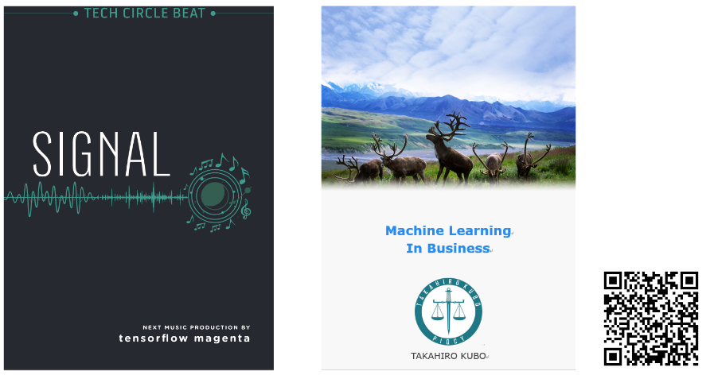
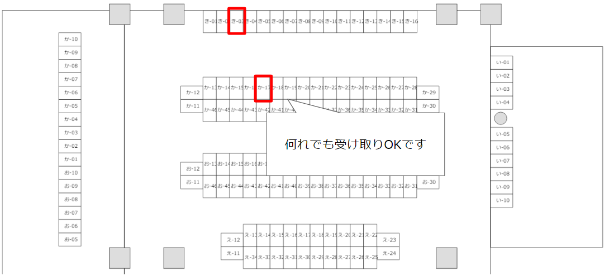

# Tech-Book2

[技術書典2](https://techbookfest.org/event/tbf02)に出店する書籍の紹介ページです。  
お試し読み、またサポート情報を提供しています。

(価格は何れも500円の予定です)

## [SIGNAL(き-03)](https://techbookfest.org/event/tbf02/circle/5970629593399296)

[SIGNAL PREVIEW](./signal_book_pre.pdf)

> 「人工知能が音楽を生成する」というと、何を思い浮かべるでしょうか。 
>  
>「とうとう人工知能はここまできたか」「作曲家の仕事も奪われるんじゃないか」「いやいや、人間にはまだま>だ・・・」 様々な印象があると思います。これらの印象は個々人のものであり、正解はありません。 
>
>ただ、印象を持つ前に等しく重要なことがあります。それは、その「人工知能」が一体何なのかをよく知ることです。 
>
>人工知能はその進化を謳う記事の多さに比べて、そもそもどういう仕組みなのか、「学習」というけれどいったい何を 学習しているのか、ということについて解説したものはほとんどありません。 ...

[SIGANL SUPPORT PAGE](./signal_support)

## [Machine Learning in Business (か-17)](https://techbookfest.org/event/tbf02/circle/4886349127614464)

[Machine Learning in Business](./MachineLearningInBusinessPre.pdf)

>...そもそも本書を書くきっかけとなったのは、こうした 「機械学習の理論・および実装」と、「ビジネスへの適用」に大きな隔たりがあると感じたためです。 機械学習をはじめとしたいわゆる「人工知能」に対する期待は過度に煽られていると感じますし、また機械学習の実装として示されるようなコードはサンプル、あるいは研究用に過ぎないことが多く、実際に本番システムの中に組み込むには難しいものになっています。
>
>本書は、こうしたギャップを克服し「適切な導入検討プロセスの下に、実運用可能な形で機械学習を組み込んだシステムを開発できるようになる」ための手引きを目指しています。...

## Reservation

お取り置き希望の方は、以下から申し込みをお願いいたします。

[お取り置き予約用フォーム](https://goo.gl/forms/6l6xLahp2mteyp3K2)

場所は[「き-03」もしくは「か-17」](https://techbookfest.org/event/tbf02/circle)です

